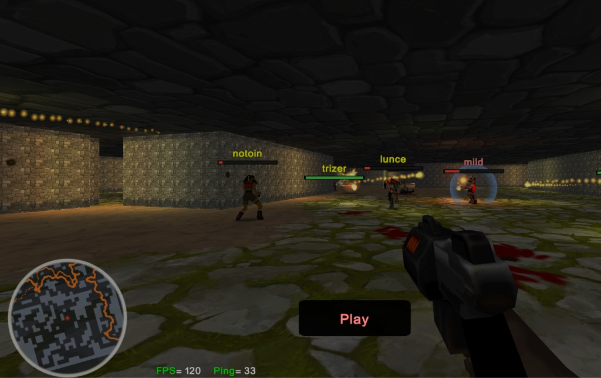

# instagib3d

[**▶ Play online**](https://instagib3d.vercel.app/)



A 3D first-person remake of [schibir/instagib.io](https://github.com/schibir/instagib.io).
The 2D engine is replaced with a WebGL renderer (lightmaps, animated lava, decals,
Quake 2 MD2 models, 3D audio), but the original gameplay — level generation, bot AI,
physics and instagib rules — runs unchanged in the browser.

## Run

```bash
pnpm install
pnpm dev
```

Opens http://localhost:3000. Other scripts: `build`, `preview`, `lint`, `format`, `test`.

## Multiplayer

Multiplayer is peer-to-peer over WebRTC (PeerJS for signaling), so there's no backend.
By default the game runs offline against bots. Set `VITE_PEER_DEFAULT_MP=true` at build
time to join a shared global room when a signaling server is configured (`VITE_PEER_HOST`).

The first player in a room is the host and runs the authoritative game; others join
automatically. If the host leaves, the remaining players re-elect a new host and the
match continues on the same map (scores are kept; positions/weapons reset).

## Console

Open with the backtick key:

- `sound on|off|toggle`, `soundVolume <0..1>`
- `god` — toggle invulnerability (offline only)
- `spectator [nick]` — follow a bot

## Licenses

- This repo's code — [MIT](LICENSE).
- Gameplay logic — [schibir/instagib.io](https://github.com/schibir/instagib.io) (MIT).
- Quake 2 source — [id-Software/Quake-2](https://github.com/id-Software/Quake-2) (GPL);
  only rendering ideas are borrowed.
- Quake 2 assets (`*.md2`, converted skins) — property of id Software, bundled for
  educational use only.
